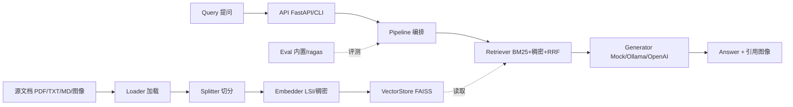

# 智答 ZhiDa · 多模态检索增强生成（Multimodal RAG）引擎

> 一套**可实际运行、性能可比、一键复现**的 RAG 系统：混合检索（BM25 + 稠密 + RRF）＋ 可插拔 LLM ＋ 多模态（文本/图像）。
> 默认路径**零模型下载**即可跑通 demo；真实稠密/CLIP/LLM 后端为可插拔（缺失时自动跳过）。
>
> 作者：**晨星** · 版本 `1.0.0` · License: MIT

---

## 一、特性

| 能力 | 说明 |
|---|---|
| 混合检索 | BM25（词法）+ 稠密（默认 LSI / 可选 sentence-transformers）+ **RRF** 融合 |
| 多模态 | 文本 + 图像入库；离线以 caption 检索并引用图像，可选 CLIP 实现真正视觉检索 |
| 可插拔生成 | `Mock`（离线默认）/ `Ollama` / `OpenAI` 一行切换 |
| 多入口 | Python API · `zhi` CLI · FastAPI REST |
| 量化评测 | 内置 recall@k + 延迟基线（零依赖）；可选 `ragas` SOTA 指标 |
| 一键复现 | `setup.sh` → `run_demo.sh`（venv + 锁版依赖 + 建库 + 问答 + 评测 + 测试 + 基线） |
| 工程纪律 | 每模块单测 + 最小示例；依赖锁定；零遗留 TODO |

---

## 二、架构



模块与职责见 [`docs/architecture.md`](docs/architecture.md)。

---

## 三、快速开始（一键）

```bash
bash scripts/setup.sh        # 创建 venv + 安装锁版核心依赖（无需模型下载）
bash scripts/run_demo.sh      # 建库 → 问答 → 评测 → 测试 → 性能基线
```

或分步：

```bash
# 1) 建索引（文本 + 图像）
python -m zhi.api.cli ingest data --persist-dir .zhi_index
# 2) 提问
python -m zhi.api.cli ask "什么是检索增强生成 RAG？" --top-k 3
# 3) 评测
python -m zhi.api.cli eval --dataset examples/qa_pairs.json --k 5
# 4) 测试
python -m pytest -q
# 5) 性能基线
python scripts/baseline.py
```

> 纯 Python 调用见 [`examples/minimal_example.py`](examples/minimal_example.py)。

---

## 四、接口清单

| 接口 | 输入 | 输出 | 协议 | 错误码 |
|---|---|---|---|---|
| `ingest(paths, persist_dir)` | 文件/目录列表 | `IndexStats{n_docs,n_chunks,dim,build_ms,embedder}` | Python API / CLI | `E_LOAD(2001)` `E_INPUT(1001)` |
| `query(q, top_k, mode)` | 问句、top_k、检索模式 | `Answer{answer,contexts[],latency_ms,mode,backend}` | REST `POST /query` / CLI / API | `E_INDEX(2003)` `E_RETRIEVE(3001)` |
| `generate(contexts, q)` | 上下文 + 问题 | 答案文本 | 内部 / REST | `E_GEN(3002)` |
| `eval(dataset)` | QA 数据集 | `Metrics{recall@k, 延迟, ragas...}` | Python API / CLI | `E_CFG(4001)` |
| `health()` | — | 状态 / 索引大小 / 后端 | `GET /health` | — |

错误码规范：`ZD_OK=0`；`1xxx` 输入；`2xxx` 建库/索引；`3xxx` 检索/生成；`4xxx` 配置；统一返回 `{code,msg,detail}`。

---

## 五、选型对比（性能 / 生态 / 许可证 / 维护）

| 环节 | 选择 | 理由 |
|---|---|---|
| Embedder | **scikit-learn TF-IDF + TruncatedSVD（LSI）**（默认） / sentence-transformers（可选） | LSI 零下载即提供稠密向量，使 hybrid 离线可用；sentence-transformers 为 SOTA 升级 |
| VectorStore | **faiss-cpu**（FAISS IndexFlatIP） / numpy 回退 | 工业级、MIT、ms 级检索；无 wheel 时自动回退保证可装性 |
| Splitter | **langchain-text-splitters**（递归切分，中文分隔符） | 生态成熟、MIT |
| 中文分词 | **jieba** | 轻量纯 Python，提升中文 BM25/TF-IDF 召回 |
| LLM | **Mock**（默认）/ Ollama / OpenAI | Mock 保证零干预 demo；后两者为可选真实后端 |
| Eval | **内置 recall@k + 延迟** / ragas（可选） | 内置零依赖；ragas 提供 faithfulness 等 SOTA 指标 |

---

## 六、性能基线（实测）

运行环境：AMD Ryzen 7 H 255 / 16GB / Windows / Python 3.13 / CPU only；样本语料 5 篇文档。

| 指标 | 数值 |
|---|---|
| 文档数 / 块数 | 5 / 5 |
| 建库耗时 | 0.82 s |
| 建库吞吐 | 6.1 chunks/s |
| embed_query 延迟 | 0.67 ms |
| 检索延迟 bm25 | 4.65 ms |
| 检索延迟 dense(LSI) | 5.11 ms |
| 检索延迟 hybrid | 6.39 ms |
| 端到端（Mock）延迟 | 5.75 ms |
| recall@5 | 1.0 |
| p95 延迟 | 5.82 ms |
| 可选 MiniLM 稠密 | SKIPPED（本沙箱 huggingface.co 被代理 502 拦截；代码就绪，网络可达即生效） |

说明：样本语料较小（稠密维度退化为 5）；在更大语料上 FAISS ANN 使检索延迟近似亚线性增长。

---

## 七、已知限制 / 优化方向

- **离线图像为 caption 检索**：默认图像以文件名/元数据作为可检索文本，并非真实视觉理解；接入 CLIP（sentence-transformers + Pillow）即可实现真正视觉检索（代码已就绪）。
- **SOTA 稠密/CLIP/LLM 对标未在本沙箱实跑**：huggingface.co 与 LLM API 在本环境不可达，相关路径以 guarded import + 跳过测试方式交付，网络可达即生效。
- **可扩展方向**：增量索引、重排（cross-encoder）、Agent 化、分布式向量库（Qdrant）、GPU 推理、流式生成。

---

## 八、DoD（验收标准）对照

- ✅ 克隆 → 一键脚本 → demo 跑通零手工干预（默认离线）
- ✅ 所有模块单测通过（34 passed）
- ✅ 依赖锁定可复现（`requirements.lock.txt` + `requirements-optional.txt`）
- ✅ 文档覆盖架构 / 部署 / 使用（见 `docs/`）
- ✅ 关键指标量化基线并含内部对标（bm25 / LSI / hybrid）

详见 [`docs/architecture.md`](docs/architecture.md)、[`docs/deployment.md`](docs/deployment.md)、[`docs/usage.md`](docs/usage.md)。
